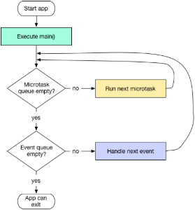

*El lenguaje Dart*

Unidad 2. El lenguaje Dart

El framework Flutter hace uso del lenguaje Dart. En esta unidad vamos a hacer una breve introducción a este lenguaje y a sus principales características, con especial atención a la programación orientada a objetos, y a los mecanismos que se ofrecen para la programación asíncrona, de gran importancia en el desarrollo de interfaces dinámicas en Flutter.

[Introducción a Dart	2******](#_toc182320686)***

[***Tipos de Datos	4******](#_toc182320687)

[***Programación Estructurada	8******](#_toc182320688)

[***Funciones	11******](#_toc182320689)

[***Colecciones	14******](#_toc182320690)

[***Programación Orientada a Objetos	19******](#_toc182320691)

[***Programación Asíncrona	31******](#_toc182320692)

[***Proyectos en Dart	36******](#_toc182320693)

[***Peticiones HTTP	39******](#_toc182320694)

1. # Introducción a Dart

## El lenguaje Dart
El lenguaje utilizado para el desarrollo en Flutter es Dart, y por eso antes de entrar con la programación de lleno con el framework, nos familiarizaremos un poco con éste.

Para trabajar con los diferentes ejemplos que veremos en esta unidad, solo tenemos que escribirlos en un fichero de texto con extensión **dart***.*

dart nombre\_de\_fichero.dart

Alternativamente, también podemos trabajar con el [Playground de Dart](https://dartpad.dev/). Éste, además, tiene la ventaja que incluye en la misma ventana el editor de código con resaltado de sintaxis y detección de errores, la salida del programa, documentación y algunos ejemplos, tanto con Dart como con Flutter para explorar las diferentes posibilidades de los mismos.

### **Conceptos básicos.**

Como muchos otros lenguajes, Dart utiliza la función *main* como punto de entrada a un programa. Partiremos de un clásico *Hola Mundo* con parámetros de entrada como ejemplo inicial:

Vemos algunos detalles de Dart en este código:

- La función **main** no vuelve ningún valor, y aunque el tipo **void** no es obligatorio indicarlo, suele ser una buena práctica hacerlo. 
- Esta función principal puede recibir argumentos, en forma de lista de cadena de caracteres (**List<String> args**). En caso de que no necesitemos argumentos, podemos usar directamente **void main().**
- Para comprobar si la lista está vacía, aunque podríamos haber comprobado si su longitud es positiva (**args.length>0**) es más correcto hacer uso de **isNotEmpty**.
- Los bloques de código deben incluirse entre llaves {}. Cuando el bloque sólo se compone de una línea de código (como es el caso de los dos **print()** al ejemplo), aunque no es obligatorio, también se aconseja hacerlo.
- Los comentarios se expresan como en otros lenguajes tipo Java o C, con // y /\* ... \*/, según sean de una línea o multilínea. 
- Para mostrar un mensaje por pantalla empleamos la orden **print()**. Cuando hay variables dentro del texto, aunque podemos usar el operador + para concatenar literales, se recomienda el uso de la interpolación de cadenas (*String interpolation*), haciendo uso del símbolo del $ ($variable) o bien de ${} si tenemos que acotar la interpolación (${variable.propiedad}), tal y como hacemos en *Bash*.
- Las sentencias en Dart acaban con punto y coma ;
- Para acceder a las listas, lo podemos hacer directamente con el operador [], como si se tratara de un vector.

### **Entrada y salida**
Como hemos visto, para mostrar mensajes para la consola podemos hacer uso de la función **print()**, pero esta no es la única forma.

Dart provee a través de la biblioteca *dart:io* mecanismos para gestionar la entrada y la entrada a través de consola y teclado, entre otros. Concretamente, para la salida por consola nos provee el método .**write()** de las clases stdout y stderr, correspondiente a la salida estándar y de error respectivamente. En cuanto a la entrada por teclado, podemos hacer uso del método **.readLineSync()** de la clase stdin.

Veamos un pequeño ejemplo:

import 'dart:io';

void main(){

`  `stdout.write("Hola! Com et diuen? ");

`  `var nom=stdin.readLineSync();

`  `print("Hola $nom!");

}

La salida de este programa será la siguiente:

$ dart exemple.dart 

Hola! Com et diuen? Jose 

Hola Jose!

Como podréis apreciar, la principal diferencia entre el método **stdout.write** y **print** es que el primero no arroja un salto de línea al final, mientras **print** sí lo hace.

Hay que decir que, la clase Stdin permite al usuario leer datos de la entrada estándar de manera tanto síncrona como asíncrona. Tal y como hemos visto, con el fin de realizar la lectura desde el teclado de forma síncrona, haremos uso del método **readLineSync().**

1. # Tipos de Datos

Los tipos de datos soportados por Dart son:

- **Numéricos**: enteros (int) y decimales (double),
- **Cadenas de caracteres**: String
- **Valores lógicos**: bool
- **Colecciones de objetos**: Listas (List), Conjuntos (Siete) y diccionarios (Map)

Para declarar una variable con Dart podemos utilizar **var**, de manera que el tipo de dato se infiera forma automática a partir del valor dado, o bien indicar directamente el tipo. Una vez se asigna un tipo a una variable, este tipo ya no se puede modificar. Veamos algunos ejemplos:

var dia='dijous';       // Infereix el tipus a String

String dia='dimarts';   // Definim un String

int numero=42;          // Definim un enter

bool laborable=true;    // Definim un valor lògic

// També podem realitza conversions de tipus

String cadena\_numero="1";               // Definim un String que conté un número

int numero2=int.parse(cadena\_numero);   // Converteix la cadena "1" a un tipus numèric

### **Constantes y finales**

Para definir **constantes** utilizaremos la palabra reservada **const**, con la que declaramos un valor en tiempo de compilación que será inmutable y no podrá ser reasignado:

const curs='Flutter'

Además, también podemos declarar datos como **final**, para indicar que no podrán ser reasignados. La diferencia con las constantes es que **un objeto declarado como *final*, aunque no pueda ser reasignado, sí es mutable**, es decir, sí pueden cambiar las propiedades internas. Por ejemplo, si definimos una lista como constante, no podremos añadirle elementos, pero si la declaramos como final, aunque no podamos asignarle otra lista, sí podremos añadir elementos.

### **Null Safety y tratamiento de valores nulos**

Dart es un lenguaje de **tipado seguro**, lo que significa que cuando declaramos una variable de algún tipo, el compilador garantiza que los valores asignados sean de este tipo. Aunque el tipado es obligatorio, indicar el tipo de una variable es opcional. En caso de que no indiquemos el tipo, éste será inferido a partir del valor con que se inicialice.

Desde la versión 2.12 (marzo de 2021), Dart soporta también *Null Safety*, de manera que, por defecto, una variable no podrá contener valores nulos a no ser que se especifique lo contrario, ahorrando así los problemas derivados de valores nulos.

Vemos los diferentes operadores con los que podemos tratar los nulos con Dart:

- **Declaración de valor *nullable* (?)**: Si queremos indicar de manera explícita que una variable puede contener valores nulos, hacemos uso del interrogante en su declaración, tal y como se hace en otros lenguajes como Kotlin:

  int? variable1; // variable1 podrà contenir el valor null

- **Operador de aserción nula (*null assertion operator*) (!)**: Se utiliza cuando queremos asignar una variable que puede contener nulos a variables que no pueden contenerlas.

  int variable2=variable1!

Ejemplo:

int? variable1;

int variable2=variable1!; // TypeError: null has no 

print(variable2);         // propertiesError: TypeError:

`                          `// null has no properties

- El error de arriba detiene la ejecución del programa. Con el fin de gestionar las excepciones que se realizan, podemos hacer uso de bloques *try-catch*, como en otros lenguajes de programación.

int? variable1;

try{

`  `int variable2=variable1!; 

`  `print(variable2);         

} catch (e){

`    `print(e.runtimeType); // -> NullError

`    `print(e);             // -> NoSuchMethodError: t1 is null

}

- **Operador nulo (??)**: Este operador devuelve el valor resultante de la expresión de la parte izquierda del operador, siempre que no sea nulo. En caso contrario nos devolverá la expresión de la derecha. Podemos verlo como una especie de operador condicional a los valores nulos:

var nom;

// Escriu el nom si no és nul, o escriu "Anònim"

print(nom ?? "Anònim");

- **Asignación consciente de nulos *(null aware assignment)* (?? =)**: Asigna un valor a una variable si ésta tiene valor *nulo*. En caso de que la variable tenga un valor previamente diferente a *null*, no se asignará.

int? variable1;   // Si no indiquem nullable donaría error

print(variable1); // Mostra null

variable1 ??= 10; 

print(variable1); // Mostra "10"

variable1 ??= 15; 

print(variable1); // Mostra "10", ja que variable1 tenia ja valor.

- **Acceso consciente de nulos *(null-aware access)***(?.): Evita que se lance una excepción cuando se accede a una propiedad o método de un objeto que puede ser nulo.

String? cadena;

print (cadena?.length);

### **El tipo *dynamic***

Dart es un lenguaje que soporta tanto tipado estático como dinámico. Cuando hablamos de **tipado estático** hacemos referencia a que los tipos se asignan *en tiempos de compilación*, por lo que se debe indicar el tipo de variable en la propia declaración, tal y como hemos visto hasta ahora. Ahora bien, Dart también soporta tipado de datos **dinámico**, de manera que hace la comprobación de tipos en *tiempo de ejecución*.

Para ello, se hace uso del tipo **dynamic**, un tipo de dato subyacente a todos los objetos Dart, y que nos permite utilizar tipado dinámico de datos, de manera que la comprobación de estos tipos se realiza en tiempo de ejecución en lugar de tiempo de compilación.

Tenim més detalls à l'article [Dart es un lenguaje de programación de tipo estático o dinámico](https://medium.com/@farhanaslam910/dart-is-a-static-or-dynamic-typed-programming-language-3d934c95b7b)

### **Tipos enumerados**

Los tipos enumerados en Dart (enum), como en otros lenguajes, nos sirven para representar un número fijo de valores constantes.

Por ejemplo, podemos definir un enumerado con los días de la semana:

enum DiesSetmana { dilluns, dimarts, dimecres, dijous, divendres, dissabte, diumenge }

Internamente, cada uno de estos valores se representa por el índice que ocupa, siendo el primero el 0.

Para acceder a estos valores, lo haremos a través de la notación punto. Por ejemplo:

DiesSetmana dia=DiesSetmana.dilluns;

Si queremos obtener una lista con los valores del enumerado, haremos uso de valijas:

List<DiesSetmana> = DiesSetmana.values;

Un tipo enumerado, al igual que las clases, debe definirse fuera de cualquier función o clase.

1. # Programación Estructurada

La programación estructurada con Dart se basa en las estructuras condicionales y de repetición habituales: *if.. else*, *switch*, *for*, *forEach* i *while*. Además, también soporta el operador condicional ternario (?).

Vamos a ver algunos ejemplos comentados de estas estructuras:

## Estructures condicionals
- **Exemple 1: l'operador if/if-else**

// Importem la llibreria dart:io, que conté

// la definició de la funció exit

import 'dart:io';

// La funció principal comprova que haja

// rebut un argument en la invocació

void main(List<String> args) {

`  `// Exemple d'if senzill

`  `if (args.length != 1) {

`    `print("Error, cal indicar un argument");

`    `exit(1);

`  `}

`  `// Agafem el valor del primer argument

`  `// Fem ús d'un bloc try-catch per si

`  `// es produeix una excepció de tipus

`  `var temperatura;

`  `try {

`    `temperatura = int.parse(args[0]);

`  `} catch (e) {

`    `print("S'ha produit l'excepció: ${e.toString()}");

`    `exit(1);

`  `}

`  `// Exemple d'if-else

`  `// Tot i que no és necessari, es recomana

`  `// utilitzar sempre les claus {}

`  `if (temperatura > 21) {

`    `print("Fa calor");

`  `} else {

`    `print("Fa fred");

`  `}

`  `// Exemple d'operador condicional ternari

`  `temperatura > 21 ? print("Fa calor") : print("Fa fred");

`  `// Exemple d'if abreviat com a expressió (assignat a una variable)

`  `var text = temperatura > 21 ? "Fa calor" : "Fa fred";

`  `print(text);

}

Para ejecutar el ejemplo anterior (si lo hemos llamado *ejemplo1.dart*), haremos:

$ dart exemple1.dart temp

Siendo *temp* un valor numérico que represente una temperatura.

- **Ejemplo 2: El operador switch**

// Importem la llibreria dart:io, que conté

// la definició de la funció exit

import 'dart:io';

// La funció principal comprova que haja

// rebut un argument en la invocació

void main(List<String> args) {

`  `if (args.length != 1) {

`    `print("Error, cal indicar un argument");

`    `exit(1);

`  `}

`  `// Exemple de switch

`  `var diaSetmana = args[0];

`  `// Fem ús del mètode toLowerCase dels

`  `// strings per passar-lo tot a minúscula.

`  `switch (diaSetmana.toLowerCase()) {

`    `case "dissabte":

`    `case "diumenge":

`      `print("No és laborable");

`      `break;

`    `default:

`      `print('És laborable o no és un dia correcte');

`  `}

}

Observad que la forma de operar es la misma que con otros lenguajes como Java, de manera que cuando el valor sobre el que estamos haciendo el switch coincide con uno de los **case**, se ejecuta su contenido hasta encontrar un **break**. De esta manera, comprobamos si el día es *sábado* o *domingo*, y ejecutamos el mismo bloque en ambos casos.

## Estructuras repetitivas
- **Ejemplo 1: Uso de for**

void main(List<String> args) {  

`  `// Exemple amb for

`  `for (int i = 0; i <= 10; i++) {

`    `//Comprovem si és parell

`    `if (i.isEven)

`      `print("${i} és parell");

`    `else

`      `print("${i} és imparell");

`  `}

}

- **Ejemplo2. Bucle while:**

// Exemple de While

void main(List<String> args) {

`  `// Requereix de la inicialització

`  `// abans del bucle

`  `int i = 0;

`  `while (i <= 10) {

`    `if (i.isEven)

`      `print("${i} és parell");

`    `else

`      `print("${i} és imparell");

`    `i++;

`  `}

}

- Ejemplo 3  Bucle do..while:

void main(List<String> args) {

`  `// inicialització prèvia

`  `int j = 0;

`  `do {

`    `// El contingut del bucle s'executarà

`    `// com a mínim una vegada.

`    `if (j.isEven)

`      `print("${j} és parell");

`    `else

`      `print("${j} és imparell");

`    `j++;

`  `} while (j <= 10);

}

1. # Funciones

## Declaración de funciones

Dart admite funciones de primer orden, es decir, funciones que no estén vinculadas a un objeto como método.

La declaración de funciones se hace de forma muy parecida a otros lenguajes como C o Kotlin:

- Función sin argumentos y sin valor de retorno

void funcio(){

`  `// Cos de la funció

}

- Función con argumentos y sin valor de retorno

void funcio(tipus1 argument1, ..., tipusN argumentN){

`  `// Cos de la funció

}

- Función con argumentos y con valor de retorno

tipusRetorn funcio(tipus1 argument1, ..., tipusN argumentN){

`  `// Cos de la funció

`  `return ValorDeTipusRetorn;

}

## Funciones anónimas y funciones flecha

Dart admite funciones sin nombre o funciones anónimas, que no pueden ser invocadas directamente, pero que pueden utilizarse como *callbacks*, es decir, como argumentos para otras funciones. 

Por ejemplo, definimos una función (*funcio*) que recibe tres argumentos: los dos primeros (*arg1* y *arg2*) son valores, y el tercero es una función anónima (*callback*). Esta función *funcio*, lo que hace a su cuerpo es invocar la función que se nos proporciona como argumento, y devuelve el valor que ésta nos proporciona:

// Funció que rep dos arguments i una

// funció anònim que fa de callback

int funcio(arg1, arg2, callback){

`  `int valor=callback(arg1, arg2);

`  `return valor;

}

En este código, estamos invocando una función que recibimos como parámetro dentro del cuerpo de otra función. Aunque la función que recibimos es una función anónima, como la hemos recibido como argumento, haciendo uso del nombre del argumento (*callback*) para invocarla.

Ahora, podemos utilizar esta función proporcionándole en el momento de la invocación la funcionalidad que queremos que realice, a través de una función anónima:

void main(){

`  `int valor=funcio(3, 4, (arg1, arg2){

`    `// Estem dins de la funció anònima

`    `return (arg1+arg2);

`  `});

`  `print(valor);

}

Como vemos la función anónima recibe dos argumentos y devuelve el valor de su suma.

### **Funciones flecha**
Por su parte, las funciones flecha o *arrow functions* nos permiten abreviar la declaración de una función anónima cuando ésta consta sólo de una línea, de manera que no utilizan ni las claves ni la palabra reservada. 

El ejemplo anterior, podría haberse expresado con funciones flecha de la siguiente manera:

int funcio(arg1, arg2, callback) => callback(arg1, arg2);

void main(){

`  `print (funcio(3, 4, (arg1, arg2) => arg1+arg2));

}

## Argumentos posicionales obligatorios, opcionales y con nombre

Las funciones en Dart admiten tres tipos de argumentos:

- Argumentos ***posicionales obligatorios***,
- Argumentos ***posicionales opcionales***, que indicaremos con [], y que pueden tener o no valor predeterminado (si no se especifica será nulo), y 
- Argumentos ***opcionales con nombre***, que indicaremos con {}, y para los que se requerirá indicar el nombre a la hora de la invocación. Cabe destacar que en este tipo de parámetros, el orden en que se indican en la invocación no importa.

Veamos algunos ejemplos:

void f1(int obligatori, [int opcional = 0]) {

`  `print("${obligatori}, ${opcional}");

}

void f2(int obligatori, {int opcionalAmbNom = 0}) {

`  `print("${obligatori}, ${opcionalAmbNom}");

}

void main() {

`  `f1(1);    // Mostra: 1, 0

`  `//f1();   // Si llancem f1() sense arguments, obtindrem

`            `// l'error: Context: Found this candidate,

`            `// but the arguments don't match.

`  `f1(1, 2); // Mostra:  1, 2

`  `f2(1);    // Mostra: 1, 0

`  `// f2(1, 2); // Si proporcionem dos arguments a f2, però

`              `// sense indicar el nom, rebrem de nou un error.

`  `f2(1, opcionalAmbNom: 3); // Mostra 1, 3

}

Cuando una llamada a función, a un método de un objeto o a un constructor hace uso de varios argumentos con nombre, es habitual separar los diferentes parámetros por líneas. Por ejemplo:

funcioX(

`    `paremetre1: valor1,

`    `parametre2: valor2

...

)

Como veremos posteriormente, esta será una construcción muy común cuando generemos componentes visuales con Flutter.

1. # Colecciones

Las colecciones son objetos que representan un grupo de elementos, y pueden tener diferentes estructuras y comportamientos. Las colecciones más habituales son las listas, los conjuntos y los mapas.

## Listas

Dart utiliza el principio del *mismo nivel de abstracción*, según el cual, un código neto no debe mezclar instrucciones de alto nivel con instrucciones de bajo nivel en la implementación de su lógica, de manera que se facilite su lectura.

Dart puede definirse como un lenguaje de alto nivel, y que no recurre a estructuras de bajo nivel como puedan ser los vectores, sino que directamente hace uso de listas (clase List) para representar colecciones ordenadas de elementos.

No obstante, Dart facilita el acceso a listas como si trabajáramos con vectores, al tiempo que nos ofrece funciones de más alto nivel que nos permiten trabajar de manera más cómoda.
### **Creación de listas**
Vemos algunas formas de definir listas:

// Llista nul·la

List llista\_nula;

// Llista Buida

List llistaBuida=[];

// Llista buida especificant el tipus

List<String> llistaBuida=[];      // Forma 1

List<String> \_llista=<String>[];  // Forma 2

// Llista amb valors

List laborals=['dilluns' , 'dimarts', 'dimecres', 'dijous', 'divendres'];

// Llista amb valors especificant el tipus

List<String> festius=['dissbte', 'diumenge'];

### **Manipulación de listas**
Y ahora vemos algunas formas de acceder y manipularlas:

// Accés a una posició

print(laborals[3]);

// Afegint elements a la llista

llistaBuida.add("Element");

// Modificant un element existent a la llista

// Compte! Aquest element ha d'existir! No afig elements!

llistaBuida[0]="Element 2";

// Eliminant l'últim element de la llista

laborals.removeLast();

// Eliminant un element en una posició de la llista

laborals.removeAt(posicio);

// Ampliant una llista completa al final d'altra

List diesSetmana=[];

diesSetmana.addAll(laborals);

diesSetmana.addAll(festius);

print (diesSetmana);

En aquest últim punt, per tal de poder usar **addAll**, necessitem que la llista estiga inicialitzada (no siga nul·la). Si haverem definit aquest llista com **a List diaSetmana**; ens haguera donat un error.

## Sets (Conjuntos)

Otra colección de elementos interesante en Dart son los *Sets* o conjuntos, que, a diferencia de las listas, no mantienen los elementos indexados y evitan así elementos duplicados.

Vemos algunos ejemplos sobre cómo definir y trabajar con conjuntos:

// Declarem un conjunt a partir d'una llista

var moduls = Set.from(["PMDM", "AD", "PSP", "DI", "SGI"]);

// Per afegir elements, fem ús d'add:

moduls.add("EIE");

// I els eliminem amb remove:

moduls.remove("EIE");

// Per saber si existeix un element al conjunt fem ús de contains

print (moduls.contains("EIE"));

## Maps (Diccionarios)

Un diccionario es una estructura de datos que almacena pares clave-valor, de manera parecida a un JSON.

Vemos algunos ejemplos sobre cómo definir y trabajar con estas estructuras:

// Definició d'un mapa i assignació de valors

Map notes;

notes={ "PMDM": 8, "AD": 9, "PSP":9, "DI":7};

// Accés

print(notes["PMDM"]);

notes["DI"]=9;

// Definició del mapa especificant els tipus:

Map<String, int> mapa2;

// Definició del mapa especificant un tipus dinàmic per al valor

Map<String, dynamic> mapa3;

// Afegint nous elements al mapa

// Si ja existeix la clau, es modifica el valor

notes["EIE"]=10;

// Eliminant elements

notes.remove("PMDM");

// Per saber si un element existeix

print (notes.containsKey("PMDM"));

## Recorrido de estructuras

Con el fin de recorrer los diferentes tipos estructurados podemos hacer uso de bucles for con el operador in, o bien haciendo uso del método forEach. 

**Recorrido de listas** 

Si definimos, por ejemplo, la lista:

List laborals = ['dilluns', 'dimarts', 'dimecre', 'dijous', 'divendres'];

Podemos recorrerla con un bucle **for.... in** de la siguiente manera:

`  `for (String dia in laborals) {

`    `print(dia);

`  `}

Y con un bucle forEach de la siguiente:

`  `laborals.forEach((dia) {

`    `print(dia);

`  `});

El método **forEach** recibe como argumento una función anónima, que se invoca para cada uno de los elementos de la lista. Esta función anónima recibe como argumento el elemento en cuestión, y lo procesa dentro del cuerpo de la función. En este caso, este procesamiento consiste en imprimir el valor.

Por otra parte, esta función anónima que proporcionamos al método forEach podría expresarse también como función flecha de la siguiente forma:

laborals.forEach((dia) => print(dia));

**Recorrido de conjuntos** 

El recorrido de conjuntos se realiza de la misma manera que las listas. Si definimos el siguiente conjunto a partir de una lista:

Set laborals =

`      `Set.from(['dilluns', 'dimarts', 'dimecres', 'dijous', 'divendres']);

Su recorrido con un bucle **for.... in** será:

for (String dia in laborals) {

`  `print(dia);

}

Y con forEach, haciendo uso de una función flecha, sería:

laborals.forEach((dia) => print(dia));

**Recorrido de Maps**

Definimos ahora un diccionario con módulos y sus calificaciones:

Map<String, int> notes = {"PMDM": 8, "AD": 9, "PSP": 9, "DI": 7};

Para recorrer este diccionario con un bucle **for.... in**, haremos uso de la propiedad **keys** del mapa, que nos proporciona una lista con las claves del mismo. Para mostrar las calificaciones para cada módulo, accederemos al valor de la clave en el diccionario:

for (String modul in notes.keys) {

`  `print("Mòdul: $modul, nota: ${notes[modul]}");

}

En cuanto al método **forEach** de los diccionarios, éste recibe dos argumentos en lugar de uno: la clave y el valor de cada uno de los elementos, de manera que para mostrar su contenido haríamos:

notes.forEach((key, value) => print("Mòdul: $key, nota: $value"));

**Mapeado de estructuras**

Las colecciones en *Dart* poseen un método *map* para transformar unas estructuras en otras. Para ello, habrá que proporcionarle una función anónima que se aplicará a cada uno de los elementos para obtener el nuevo elemento correspondiente.

Vemos con un ejemplo, cómo convertir un conjunto de *Strings* expresados en mayúscula, en una colección donde se expresan en minúscula.

void main(){

`  `// Definim un conjunt d'elements

`  `var moduls = Set.from(["PMDM", "AD", "PSP", "DI", "SGI"]);

`  `print(moduls);

`  `// I are utilitzem el mètode map per processar

`  `// cadascun dels elements del conjunt

`  `// (En aquest cas, els convertim a minúscula)

`  `var moduls2=moduls.map((item) {

`    `return item.toString().toLowerCase();

`    `});

`    `print (moduls2);

}

Disponemos de más documentación sobre colecciones e iterables en:

El artículo [*Top 10 métodos para manipular colecciones en Dart*](https://www.tecnoblog.org/desarrollo/dart-manipular-colecciones-top-10-metodos/), en Tecnoblog.org.

El codelab de Dart sobre iterables: <https://dart.dev/codelabs/iterables>

1. # Programación Orientada a Objetos

La orientación a objetos es de gran importancia en Dart, y sobre todo en Flutter, ya que en estos conceptos se basará todo el diseño de interfaces mediante *widgets*.

## Clases y constructores

La sintaxis básica para crear una clase en Dart es bastante parecida a otros lenguajes, como Java:

class NomClasse {

`    `Tipus1? propietat1;

`    `Tipus2? propietat2; 

...

`    `// Constructor (opcional)

`    `NomClasse(Tipus1 arg1, Tipus2 arg2,...){

`        `propietat1=arg1; // Podem utilitzar this.propietat1, però no es recomana

`        `propietat2=arg2; // D'igual manaera amb this.propietat2

...

`    `}

}

Veamos algunos detalles. Por un lado, el constructor de la clase es opcional. En caso de que éste no se declare, Dart utiliza un constructor predeterminado sin argumentos. 

Si incorporamos un constructor a la clase, este se trata de un método con el mismo nombre que la clase y sin tipos, tal y como se hace en Java. 

Fijémonos que en el ejemplo hemos definido las propiedades como *nullables*. En caso de no hacerlo así, el compilador nos daría el error *Non-nullable instance field 'nom\_propietat' must be initialized* indicando que es necesario inicializar esta propiedad. Estos valores iniciales los podemos dar en la misma definición de las propiedades.

class NomClasse {

`    `Tipus1 propietat1=valor\_inicial\_1;

`    `Tipus2 propietat2=valor\_inicial\_2;

...

`    `}

### **Instanciación de objetos**
Con el fin de crear un objeto de la clase anterior, podríamos hacerlo con:

NomClasse objecte = Classe(param1, param2);

Aunque podemos usar la palabra clave **new** (**new Clase(param1, param2)**), esta es opcional, y cuando trabajamos con Flutter, se recomienda no utilizarla.

Por otra parte, si intentamos imprimir el objeto (**print(objeto);**) nos dirá que es una instancia de **NomClasse**. Si lo que queremos es que nos muestre el contenido, deberíamos sobreescribir el método **toString** de la siguiente manera:

@override 

String toString() {

`  `return 'Propietat1: $propietat1, Propietat2: $propietat2';

`  `}

Hay que decir que, en Dart, la anotación **@override** también es opcional, y podríamos omitirla.

Por otro lado, en expresiones como la anterior debemos tener especial cuidado si optamos por utilizar el **this**. Aunque no es recomendable, si utilizamos este habría que hacer uso de las claves para delimitar el alcance del $, de la siguiente manera:

return 'Propietat1: ${this.propietat1}, Propietat2: ${this.propietat2}';

Si sólo empleáramos $this.propiedad1 o $this.propedad2 estaríamos intentando imprimir la misma clase ($this), por lo que se invocaría a este método de forma recursiva, entrando pues en un bucle infinito.

Un ejemplo más completo de lo que hemos explicado podría ser el siguiente:

class Persona {

`    `String? nom;

`    `String? cognoms; 

`    `Persona(String arg1, String arg2){

`        `nom=arg1;

`        `cognoms=arg2;

`    `}

`  `@override 

`  `String toString() {

`    `return 'Nom: $nom, Cognoms: $cognoms';

`  `}   

}

void main (){

`  `Persona objecte=Persona("Luke", "Skywalker");

`  `print(objecte.toString());

}

Puede comprobar su funcionamiento en el siguiente Gist: <https://dartpad.dev/?id=ef81399b2c2675ff9ead65d16f3b171e>.

### **Simplificación del constructor**
El constructor es pot simplificar de la següent manera:

NomClasse(this.propietat1, this.propietat2);

Con lo cual, además, conseguimos que las propiedades se inicialicen en la misma definición, de manera que no sea necesario declarar éstas como *nullables*.

Para el ejemplo de la clase *Persona* tendríamos:

Persona(this.nom, this.cognoms);

### **Constructores con paso de argumento por nombre**
También es bastante habitual pasar los parámetros de inicialización del constructor por nombre, en lugar de hacerlo de forma posicional. Esto lo conseguimos con las llaves **{}**:

NomClasse({

`    `required this.propietat1,

`    `required this.propietat2

`    `});

El uso de la palabra reservada **required** indica la obligatoriedad de incluir el argumento, de manera que evitemos valores nulos. Si no utilizáramos el **required**, sería necesario bien indicar que es una propiedad *nullable* o indicarle un valor predeterminado, bien sea en su definición o bien en los parámetros del constructor:

// En la definició de la propietat

class NomClasse{

...

`    `Tipus? propietat1; // Propietat Nullable

`    `Tipus propietat2=valor; // Amb valor predeterminat

`    `Tipus propietat3;

...

`    `NomClasse({

`        `this.propietat1, 

`        `this.propietat2,

`        `this.propietat3=valor // Valor predeterminat al constructor

`    `});

}

Cuando definimos una propiedad como no nulable y no vamos a inicializarla en la misma declaración, podemos hacer uso de la palabra reservada late:

late Tipo propiedad;

Para indicar que esta propiedad se inicializará más adelante. Si el compilador detecta su uso antes de la inicialización nos dará un error. Esto nos permite declarar variables, pero inicializarlas más tarde (por ejemplo, en el constructor)

Sea como sea, de esta manera, cuando creamos un objeto lo haremos con:

NomClasse objecte=NomClasse(

`    `propietat1: valor1,

`    `propietat2: valor2,

...

)

Y no importa el orden en que ponemos los argumentos, ya que lo que cuenta ahora es el nombre.

Veamos el ejemplo de la clase *Persona* más detallado en el Gist: <https://dartpad.dev/id=438a3989dd9643df3c5eaa97e259ae29>.

### **Múltiples constructores con nombre (named constructor)**
Dart no soporta sobrecarga de constructores. Para posibilitar la construcción de objetos mediante diferentes métodos se utilizan los constructores con nombre, que también aportan mayor claridad a las declaraciones. Para definir un constructor con nombre hacemos uso del punto para separar al constructor del nombre:

NomClasse.constructor\_amb\_nom1(llista\_arguments\_1){...}

NomClasse.constructor\_amb\_nom2(llista\_arguments\_2){...}

Veremos un ejemplo de uso concreto de estos constructores en el siguiente apartado.

### **Inicialización con diccionario**
Uno de los aspectos más interesantes y comunes en Dart es la creación de objetos a partir de un diccionario o JSON. Por ejemplo:

final objecteJSON={

`    `propietat1: valor1,

`    `propietat2: valor2

}

Per crear l'objecte, podem crear un constructor amb nom que s'inicialitze a partir d'un JSON, de la següent manera:

class NomClasse{

...

`    `NomClasse.fromJSON( Map <Tipus1, Tipus2> objecteJSON){

`        `propietat1=objecteJSON['propietat1'] ?? "valor\_per\_defecte1",

`        `propietat2=objecteJSON['propietat2'] ?? "valor\_per\_defecte2";

...

`        `}

...

}

Veamos los detalles:

- El constructor NomClasse.fromJSON recibe un diccionario (Map) como argumento, que se utilizará para inicializar las propiedades de la instancia.
- En la declaración del mapa como argumento, definimos los tipos de la clave y el valor (<Tipo1, Tipo2>). Si no se indica, Dart infiere los tipos directamente.
- Dentro del constructor, asignamos valores a las propiedades obteniéndolas del JSON. En caso de que no se encuentre la propiedad en el JSON, con el operador ?? podemos asignar valores por defecto.

También hemos comentado que un constructor con nombre aporta claridad a las definiciones. En este caso, hemos hecho uso de un nombre que indica explícitamente que se utiliza un JSON para crear el objetivo (.fromJSON), pero este nombre podría ser cualquiera.

Para crear un objeto de esta manera, ya podemos hacerlo con:

NomClasse elMeuObjecte=NomClasse.fromJSON(objecteJSON)

**Exemple**

Seguint amb l'exemple sobre la definició de persones, podríem fer ús d'un constructor amb nom de la següent forma:

class Persona {

...

`  `Persona.fromJSON(Map <String, dynamic> objecteJSON){

`    `nom=objecteJSON['nom'];

`    `cognoms=objecteJSON['cognoms'];

`    `anyNaixement=objecteJSON['anyNaixement'];

`    `especie=objecteJSON['especie'] ?? "Humana";

`  `}

}

void main (){

...

`  `Map <String, dynamic>  myJSON={

`    `"nom": "Han", 

`    `"cognoms":"Solo"

`    `};

`  `Persona p3=Persona.fromJSON(myJSON);

`  `print (p3.toString());

}

Disponemos del ejemplo completo al siguiente Gist: <https://dartpad.dev/?id=21a4a94acecb821196438a3e410cc141>.

class Persona {

`  `// Declaració de propietats

`  `String? nom;

`  `String? cognoms;

`  `String? anyNaixement;

`  `String? especie;

`  `// Constructor principal

`  `Persona(

`      `{required this.nom,

`      `required this.cognoms,

`      `this.anyNaixement,

`      `this.especie = "Humana"});

`  `// Constructor amb nom. Creem un objecte a partir d'un JSON

`  `Persona.fromJSON(Map<String, dynamic> objecteJSON) {

`    `nom = objecteJSON['nom'];

`    `cognoms = objecteJSON['cognoms'];

`    `anyNaixement = objecteJSON['anyNaixement'];

`    `especie = objecteJSON['especie'] ?? "Humana";

`  `}

`  `@override

`  `String toString() {

`    `return '''\nNom: $nom

Cognoms: $cognoms

Any de naixement: $anyNaixement

Espècie: $especie''';

`  `}

}

void main() {

`  `// Creació d'un objecte Persona a partir de dos atributs

`  `Persona p1 = Persona(nom: "Luke", cognoms: "Skywalker");

`  `print(p1.toString());

`  `// Creació d'un objecte Persona a partir de quatre atributs

`  `Persona p2 = Persona(

`      `nom: "Ashoka",

`      `cognoms: "Tano",

`      `anyNaixement: "36ABY",

`      `especie: "Togruta");

`  `print(p2.toString());

`  `// Definició d'un JSON

`  `Map<String, dynamic> myJSON = {"nom": "Han", "cognoms": "Solo"};

`  `// Creació d'un objecte Persona a partir del JSON

`  `Persona p3 = Persona.fromJSON(myJSON);

`  `print(p3.toString());

}

### **Listas de inicializadores o de inicialización**
Otra forma en que nos podemos encontrar los constructores en Dart es haciendo uso de listas de inicializadores, consistente en una lista de inicializaciones, separadas por comas que se ejecutan antes del código del constructor. Por ejemplo, el constructor Persona.fromJSON del apartado anterior, podrían haberse expresado con listas de inicialización de la siguiente forma:

`  `Persona.fromJSON(Map <String, dynamic> objecteJSON):

`    `nom=objecteJSON['nom'],

`    `cognoms=objecteJSON['cognoms'],

`    `anyNaixement=objecteJSON['anyNaixement'],

`    `especie=objecteJSON['especie'] ?? "Humana";

Como vemos, la única cosa que hemos hecho es eliminar las claves que definían el bloque, y hacer uso de los dos puntos para indicar la lista separada por comas de inicializadores.

**Métodos de acceso**

Dart no contempla palabras reservadas como **public** o **private**. De manera predeterminada, toda propiedad que declaramos será pública. Si lo que queremos es que ésta sea privada, lo indicaremos a su nombre, haciendo que éste comience por el guión bajo \_.

class NomClasse{

`    `Tipus \_propietatPrivada;

}

Ahora bien, hay que tener en cuenta que este nivel de privacidad es en el ámbito de la librería, o lo que en Kotlin o Java sería un paquete, y representaría la aplicación.

Así pues, desde cualquier clase de nuestra aplicación tendremos acceso a las propiedades del resto de clases de la misma, bien sean públicas o privadas.

Entonces, ¿tiene sentido utilizar modificadores de aceso? Aunque son menos frecuentes, los métodos de acceso pueden emplearse con el fin de obtener propiedades derivadas, o para establecer valores a partir de estas propiedades derivadas.

Para crear *getters* y *setters*, lo haremos de la siguiente forma:

tipusRetorn get nomPropietatDerivada {

`    `return càlcul\_de\_la\_propietat;

}

set nomPropietatDerivada (Tipus parametre){

`    `// Actualització de les propietats internes

}

Por ejemplo, si en la clase Persona queremos añadir un campo derivado que siga la edad, podríamos definir los métodos **get** y **set** de la siguiente forma:

` `class Persona {

`  `String? nom; 

`  `int? anyNaixement;

...

`  `int get edat{

`    `// Obtenim la data actual, instanciant un objecte DateTime

`    `DateTime currentTime = DateTime.now();  

`    `// L'any es troba a la propetat year de l'objecte currentTime

`    `return currentTime.year-(anyNaixement ?? 0);

`  `}

`  `set edat (int edat){

`    `// Establim l'any de naixement a partir de l'edat

`    `this.anyNaixement=DateTime.now().year-edat;

`  `}

}

En estos métodos hemos hecho uso de la clase [*DateTime*](https://api.dart.dev/stable/2.18.5/dart-core/DateTime-class.html) que representa datos referentes al tiempo. Con **DateTime.now()** obtenemos el instante actual, a partir del cual podemos obtener el año con la propiedad year.

En este caso, lo que hacemos es *definir* un método **set** y otro **get** que, haciendo uso del año actual y el año de nacimiento, gestionan una *propiedad derivada* que es la edad, de manera que con un objeto de tipo ***Persona*** podríamos hacer uso de edad como si se tratara de una propiedad de la misma clase:

**p.edat=40;**

**print(p.edat);**

Podemos ver el ejemplo completo en el siguiente Gist: <https://dartpad.dev/?id=778bd9b1b8ddd253a6d1e7899b729a06>.

class Persona {

`  `String? nom; 

`  `int? anyNaixement;

`  `// Constructor simplificat amb nom

`  `Persona({

`    `required this.nom, 

`    `required this.anyNaixement});

`  `int get edat{

`    `// Obtenim la data actual, instanciant un objecte DateTime

`    `DateTime currentTime = DateTime.now();  

`    `// L'any es troba a la propetat year de l'objecte currentTime

`    `return currentTime.year-(anyNaixement ?? 0);

`  `}

`  `set edat (int edat){

`    `// Establim l'any de naixement a partir de l'edat

`    `this.anyNaixement=DateTime.now().year-edat;

`  `}

}

void main (){

`  `Persona p=Persona(nom:"Jose", anyNaixement: 1978);

`  `print (p.edat);

`  `// Canviem la propietat derivada "edat"

`  `p.edat=40;

`  `print(p.anyNaixement);

}

## Herencia
Para que una clase pueda heredarse, necesita tener un constructor vacío, sin argumentos, que será el constructor predeterminado que usarán las subclases. **El resto de constructores, no se heredarán.**

class SuperClasse{

`  `String propietat1;

`  `// Constructor per defecte, amb llista d'inincialització

`  `SuperClasse():propietat1="Valor per defecte en la superclasse";

`  `// Constructor amb nom (no s'hereta)

`  `SuperClasse.fromString(String s): this.propietat1=s;

}

Para definir una subclase, haremos uso de la palabra **extends**:

class SubClasse extends SuperClasse {

`  `// Els constructors no s'hereten

}

Con ello podemos crear instancias de la subclase con:

// Instància de la subclasse

SubClasse sc1=SubClasse();

print("Propietat 1 de la subclasse: ${sc1.propietat1}");

El que no podem fer, per exemple és utilitzar el constructor amb nom fromString a la subclasse:

// Error, el constructor fromString no s'hereta!

SubClasse sc2=SubClasse.fromString("Prova"); 

Pero lo que sí podemos hacer, es definir al constructor en la subclase e invocar al constructor de la superclase:

class SubClasse2 extends SuperClasse {

`  `// Constructor amb nom que invoca el constructor

`  `// amb nom de la classe pare.

`  `SubClasse2.fromString(String s): super.fromString(s);

}

Ahora sí podemos invocar:

SubClasse sc2=SubClasse.fromString("Prova");

## Clases abstractas
Como sabemos, las clases abstractas no pueden ser instanciadas, y sirven para definir subclases, que deben implementar necesariamente los métodos indicados en la clase abstracta. Para indicar una clase abstracta, utilizamos la palabra clave **abstract**. Por ejemplo:

abstract class Figura{

`  `int posx;

`  `int posy;

`  `void calculaArea(){

`    `print('Calcul per defecte');

`  `}

}

class Rectangle extends Figura {

`  `int base;

`  `int altura;

`  `@override // Opcional

`  `void calculaArea() {

`    `print (this.base\*this.altura);

`  `}

}

## Interfaces y Mixins
Dart introduce el concepto de *interfaz implícita*, consistente en que cualquier clase puede usarse de interfaz. Para declarar que una clase implementa los métodos de otra clase, se utiliza la palabra reservada **implements**.

class ClasseQueImplementaInterficie implements ClasseQueFaDeInterficie{

`  `// Implementació dels mètodes de la Classe que fa d'interficie

}

Dart, como la mayoría de lenguajes, tampoco soporta la herencia múltiple. Además, y a diferencia de la mayoría de ellos, tampoco suelen usarse las interfaces como aproximación a este tipo de herencia.

El mecanismo que introduce Dart para crear clases que serían una combinación de otros son los ***mixins***, un concepto más cercano al de heréncia múltiple que el de las interfaces.

Un *mixin* podría definirse como una clase que deriva de otra, pero combinada con otras clases. Para definir un *mixin* hacemos uso de la palabra reservada with.

Por ejemplo, si tenemos definidas las claseS A, B y C, con los métodos fA(), fB() y fC() respectivamente:

class A{

`  `void fA(){

`    `print ("En A");

`  `}

}

class B{

`  `void fB(){

`    `print ("En B");

`  `}

}

class C{

`  `void fC(){

`    `print ("En C");

`  `}

}

Podemos definir el *mixin* claseMixta como una clase derivada de la clase A, pero *mezclada con* las clases B y C:

mixin ClasseMixta implements A, B, C {}

Lo que indica que *ClaseMixta* deriva de la clase A, pero donde tendremos accesibles también las propiedades y métodos de las clases B y C, de manera que podemos hacer lo siguiente:

` `ClasseMixta m=ClasseMixta();

`  `m.fA();

`  `m.fB();

`  `m.fC();

1. # Programación Asíncrona

En este apartado vamos a abordar uno de los aspectos más complejos y a la vez interesantes del lenguaje Dart: la programación asíncrona. Complejo porque suponen un cambio en la concepción tradicional de la programación concurrente, basada en hilos, e interesante porque juega un papel fundamental en la programación reactiva de Flutter.

## Programación Asíncrona en Dart
El asincronismo hace referencia a un modelo de programación donde es posible que determinadas operaciones devuelvan el control de la ejecución al programa que las ha invocado antes de haber terminado. 

Los lenguajes de programación ofrecen diferentes tipos de mecanismos para tratar esta programación, como puedan ser los threads en Java o las corrutinas en Kotlin, entre muchos otros.
### **Future**
Dart y Flutter hacen uso de la clase *Future* y *async/await* para trabajar funciones de forma asíncrona.

Los *Futures* definen tipos de datos asociados a tareas asíncronas, que no se resuelven de forma inmediata. Un ejemplo bastante habitual de este tipo de tareas consiste en las peticiones que realizamos a un servidor, que sabemos que obtendrán respuesta en algún momento, pero no sabemos cuándo.

Para ver un ejemplo que simule una función asíncrona, definiremos la siguiente:

Future<String> funcioAsincrona(){

` `return Future.delayed(Duration(seconds: 1), (){

`   `print("Estem en funcioAsincrona");

`   `return 'Valor de retorn';

` `});

}

Esta función devuelve un objeto de tipo *Future* al cabo de un segundo, que contendrá un *String*. O siendo más precisos, nos devuelve un objeto de tipo *Future*, que al cabo de un segundo lanzará una función que nos devuelve un *String*.

Para simular la pausa, hemos utilizado el método **delayed** de la clase **Future**. Este método recibe un objeto de tipo Duration como primer argumento, y una función de callback, sin argumentos como segundo. Observe que dentro de esta función de callback se realiza también un returno.

La clase [Duration](https://api.dart.dev/stable/2.18.5/dart-core/Duration-class.html) representa una duración, o lo que es lo mismo, la diferencia entre dos instantes de tiempo. Con el fin de crear un objeto de tipo **Duration**, hacemos uso de su constructor, al que le podemos proporcionar diferentes argumentos por nombre (hours, minutes, seconds..). En el ejemplo, se ha puesto una duración de un segundo, haciendo uso del argumento **seconds**.

Vamos a ver el funcionamiento mediante el siguiente programa:

void main(){

`  `print("Inici");

`  `var a=funcioAsincrona(); 

`  `print(a);

`  `print("Final");

}

El resultado que se nos mostrará por pantalla será:

Inici

Instance of '\_Future<String>'

Final

Estem en funcioAsincrona

Como era de esperar, lo primero que muestra es el texto *Inicio*, correspondiente al primer **print** del programa. Después, se invoca a la función asíncrona y se muestra el resultado que ésta devuelve: **Instance of '\_Future<String>**'. Es decir, un objeto de tipo Future, que contendrá *en un futuro* un ***String***.

Para obtener realmente el valor, debemos esperar a que éste se *resuelva*, haciendo uso del método **then** de la clase Future:

Future<String> a=funcioAsincrona(); 

a.then( ( String data ) {

`  `print(data);

} );

Este método **then** se invocará cuando la función asíncrona devuelva el valor, y recibirá, ahora sí, un dato de tipo **String** con el resultado de función. Se suele decir que la variable a se *resuelve* en este momento.

Si lo añadimos al ejemplo: 

Veremos que la salida es:

Inici

Instance of '\_Future<String>'

Final

Estem en funcioAsincrona

Valor de retorn

Como vemos, la ejecución del programa ha seguido su camino, y la función se ha ejecutado y resuelto de forma asíncrona, pero ahora ya tenemos acceso al resultado.

### **Async/Await**
Cuando se desea que una función asíncrona tenga un comportamiento síncrono, podemos hacer uso de la palabra clave **await**. De esta manera, cuando se invoca una función asíncrona, le estamos indicando a Dart que se espere a la finalización de la misma, en lugar de seguir su ejecución.

Esto se indicaría de la siguiente forma:

String a = await funcioAsincrona();

print(a);

De esta manera, en la misma llamada, esperaríamos la finalización de la función asíncrona (la haríamos síncrona), y el cambio más importante, **ya recibiríamos directamente el String que devuelve la función, en lugar del Future que recibimos antes**.

Además, cuando utilizamos un **await** dentro de una función (incluso la función **main**), ésta debe declararse como **async**, de la siguiente manera:

void main() async {

`  `print("Inici");

`  `String a=await funcioAsincrona(); 

`  `print(a);

`  `print("Final");

}

Con esto el resultado ya será el esperado en un comportamiento síncrono:

Inici

Estem en funcioAsincrona

Valor de retorn

Final

### **Tras el asincronismo en Dart: El evento Loop o Bucle de eventos**
Cuando iniciamos una aplicación en Dart (y por extensión en Flutter), se crea un proceso nuevo, o un *Isolate* en terminología más propia de Dart. Este hilo será único, de manera que las operaciones se realizan una tras otra. Además, mientras se está efectuando una operación, ésta no será interrumpida por ningún otro proceso.

En este contexto, cabe preguntarnos cómo gestiona Dart la concurrencia, teniendo en cuenta, además, que cuando trabajamos con Flutter nos encontraremos en un entorno completamente dirigido por eventos.

La respuesta se encuentra en el bucle de eventos o *Event Loop*, el secuenciador de código de Dart.

Cuando creamos un proceso o *Isolate* de Dart se realizan las siguientes operaciones:

1. Se inicializan dos cúes FIFO: *MicroTask* y *Event*, que almacenarán tareas a llevar a cabo con diferentes prioridades.
1. Se ejecuta el método main()
1. Una vez finalizado el main, se lanza el Event Loop, que irá ejecutando de forma ordenada las tareas de las colas.

El funcionamiento de este Event Loop es el que podemos ver en el siguiente diagrama de flujo:

Básicamente, el proceso de Dart no finaliza mientras quedan tareas pendientes en alguna de las colas.

La principal diferencia entre ambas colas es la prioridad, ya que la cola de microtareas tiene preferencia respecto a la de eventos. Esta cola de microtareas suele utilizarse para acciones internas muy cortas que deben ejecutarse de forma asíncrona después de finalizar cierta operación, y antes de devolver el control al bucle de eventos. Por otro lado, los eventos se lanzan cuando la cola de microtareas está vacía, y quedan eventos pendientes.

Generalmente, trabajaremos con eventos, como pueda ser la lectura de un fichero, la recepción de la respuesta a una petición de red, o la lectura de la base de datos.

Veamos el siguiente ejemplo, donde, se generarán dos tareas, una que será un evento de temporizador (**Future.delayed**), que se dispara a los 0 ms, y la otra una microtarea programada mediante la función **scheduleMicrotask** de la librería **async**:

import 'dart:async';

void main() {

`  `print("Inici");

`  `Future.delayed(

`      `Duration(milliseconds: 0), 

`      `() => print("Hola des de de la cua d'events")

`  `);

`  `scheduleMicrotask(

`      `() => print("Hola des de la cua de micotasques")

`  `);

`  `print("Final");

}

El resultado de la ejecución de este programa es:

Inici

Final

Hola des de la cua de micotasques

Hola des de de la cua d'events

Dispone de información adicional sobre el Evento Loop en los siguientes artículos:

- [Modos de ejecución de código en Flutter](https://medium.com/comunidad-flutter/modos-de-ejecuci%C3%B3n-de-c%C3%B3digo-en-flutter-f7941030e3a1)
- [El bucle de eventos y el dardo](https://dart.cn/articles/archive/event-loop)

Además, también tenéis a vuestra disposición el siguiente *codelab* sobre *Futures* y *Async/Await* de la documentación oficial de Dart: <https://dart.dev/codelabs/async-await>

## Streams
Los *Streams* fueron introducidos por el equipo de Flutter en la Google I/O de 2018, y constituyen el principal componente de la programación reactiva en Flutter.

Cuando hablamos de programación reactiva nos referimos a la propagación de los cambios en el estado de la aplicación con el fin de mantener la coherencia de la misma. Así, la aplicación *reacciona* a los cambios a medida que ocurren, y evita tener que realitar las actualizaciones de estado de forma manual.

Atención

De momento vamos a dejar apartados los Streams, para no cargar un tema que ya es potente con lo visto hasta aquí.

Los retomaremos en el futuro si es necesario.
1. # Proyectos en Dart 

## Proyectos con Dart
Hasta ahora hemos desarrollado programas con Dart que consistían con un único fichero, y que ejecutábamos con el orden la herramienta de la línea de órdenes dart.

Cuando nuestro programa crece y debemos dividir su funcionalidad en diversos ficheros, nos surge la necesidad de generar un proyecto *Dart* completo, de manera que nos permita también indicar dependencias de terceros y más opciones de configuración. Para ello, utilizaremos la suborden **create** del orden **dart**.

Si ejecutamos directamente **dart create** podremos ver las diferentes opciones que nos ofrece. En nuestro caso, y a modo de ejemplo que continuaremos en el siguiente apartado, crearemos un proyecto sencillo de consola que llamaremos info\_provincies (recuerde que, en Dart, los proyectos no pueden tener mayúsculas). Para ello, dentro de la carpeta donde queramos almacenar nuestros proyectos, escribiremos la orden:

$ dart create -t console-simple projecte\_exemple

Esto nos generará una estructura de proyecto Dart habitual en la carpeta *projecte\_exemple*, donde lo que más nos interesa es el fichero con las propiedades del proyecto (*pubspec.yaml*) y el directorio con el código fuente (*bin* en el caso de Dart).

Si consultamos la carpeta generada veremos que contiene el siguiente contenido:

projecte\_exemple

├── analysis\_options.yaml

├── bin

│   └── projecte\_exemple.dart

├── CHANGELOG.md

├── pubspec.lock

├── pubspec.yaml

└── README.md

Donde además del pubspec y la carpeta bin encontramos un fichero para el control de cambios (changelog) un fichero readme o un .gitignore, entre otros.

Cuando trabajamos con Flutter, veremos que la estructura del proyecto es muy parecida, ya que un proyecto Flutter también es un proyecto Dart. La principal diferencia que encontraremos será que el código fuente estará ubicado en la carpeta lib en lugar de bin.

### **Paquetes y librerías: El gestor pub**
Dart hace uso de *paquetes* con el fin de gestionar software compartido, como puedan ser las bibliotecas u otros paquetes de utilidades.

El gestor de paquetes que utiliza Dart es **pub**, y nos permite cargar paquetes desde el sistema de ficheros locales o repositorios *Git*. No obstante, generalmente haremos uso del repositorio de paquetes público *pub.dev*. El gestor *pub* se encargará también de gestionar y descargar las dependencias entre paquetes, teniendo en cuenta la versión del SDK.

La mayoría de los IDE que permiten trabajar con Dart ofrecen soporte para utilizar *pub*, y permiten crear, descargar, actualizar o publicar paquetes. VSCode nos permite interactuar con el sistema *pub* a través de la extensión de *Dart*, así como añadir nuevas dependencias mediante la extensión *Pubspec Assist*.

Con el fin de añadir dependencias a un proyecto, podemos directamente editar este fichero *pubspec.yaml*, o bien utilizar el orden dart pub add.

Por ejemplo, añadiremos al proyecto *projecte\_exemple* la dependencia de la [librería http](https://pub.dev/packages/http), que utilizaremos en el siguiente apartado, y que se encarga de realizar y gestionar peticiones HTTP en la web. Para ello, tenemos varias opciones:

- **Opción 1. Añadir la librería desde la línea de órdenes**

Desde dentro del directorio del proyecto haríamos:

dart pub add http

Con lo que se nos afianza la línea siguiente al fichero **pubspec.yaml**, dentro de la sección **dependencies**:

`  `http: ^1.2.2

- **Opción 2. Modificar el fichero *pubspec.yaml* directamente**

dependencies:

`  `http: ^1.2.2

- **Opción 3. Añadir la dependencia haciendo uso de la extensión Pubspec Assist**

Desde VSCode, podemos añadir la dependencia haciendo uso de la extensión Pubspec Assit. Para ello, activamos la paleta de órdenes de VSCode (con Ctrl + Shift + P en GNU/Linux y Windows o Command+Shift+P en Mac), y buscando el orden *Pubspec Assit: Add/update dependencies*.

Si nos encontramos en un directorio donde tengamos el fichero *pubspec.yaml*, nos pedirá qué extensión queremos instalar. Indicamos http y automáticamente se nos añadirá la dependencia al fichero.

**Descarga de librerías**

Cuando añadimos una dependencia desde la línea de órdenes (con dart pub get), y si hemos editado, siga como sea el fichero *pubspec.yaml* desde VSCode, el paquete se descarga automáticamente.

En caso de que hayamos modificado el fichero con otro editor, o bien que hemos obtenido un proyecto que no tiene todavía las dependencias descargadas, podemos descargarlas e instalarlas manualmente con el orden dart pub get (en Flutter, posteriormente, utilizaremos flutter pub get):

$ dart pub get

Resolving dependencies... 

Got dependencies!

Tal y como se indica en la [documentación oficial de Dart](https://dart.dev/tools/pub/cmd/pub-get#the-system-package-cache), y a diferencia de otras plataformas como nodejs o Java, las dependencias no se guardan en el mismo proyecto, sino en una *caché* de paquetes del sistema.

La idea es que, como hay varios paquetes que pueden utilizar la misma versión de una dependencia, ésta sólo se descargue una vez, y quede almacenada en esta memoria del sistema.

Si examinamos algún proyecto de Dart, veremos que hay un directorio oculto llamado .dart\_tool que contiene un fichero package\_config.json. Este fichero contiene información sobre las librerías que necesita el proyecto, las versiones, y en qué ubicación de esta *caché* se encuentran. La ubicación más habitual de la misma está en el directorio ~/.pub-cache/hosted/pub.dartlang.org/ de nuestra carpeta personal.

1. # Peticiones HTTP

En aquest apartat realitzarem amb Dart algunes consultes a la Web, fent ús de la llibreria HTTP que hem instal·lat anteriorment.

## La llibrería [HTTP](https://pub.dev/packages/http)
En el apartado anterior ya hemos visto cómo incorporar la librería HTTP a nuestro proyecto, la cual nos permitirá llevar a cabo peticiones HTTP a cualquier recurso de red, haciendo uso de *Futures*.

La librería HTTP, internamente define un conjunto de clases y funciones de alto nivel para el consumo de recursos HTTP, como puedan ser las funciones **get()**, **post()**, **update()**, **put()** o **delete()**, entre muchas otras.

La forma más sencilla de utilizar la biblioteca es importándola a nuestro código con:

import 'package:http/http.dart';

y hacer uso directamente de estas funciones de nivel superior (no asociadas a ningún objeto).

Otra opción bastante frecuente es definir un espacio de nombres como un *alias* bajo el cual referenciar toda la librería. Para ello, la importaremos de la siguiente forma:

import 'package:http/http.dart' as http;

De manera que accedim a les funcionalitats que s'ofereixen com si es tractara de mètodes de l'espai de noms *http*: **http.get()**, **http.post()**, etc.

## Ejemplo de uso
Vamos a hacer de los siguientes recursos en la web que nos ofrecen información sobre las diferentes comarcas de nuestro territorio:

- https://node-comarques-rest-server-production.up.railway.app/api/comarques y https://node-comarques-rest-server-production.up.railway.app/api/comarques/provincies, que nos ofrece una lista de las tres provincias de la comunidad.
- https://node-comarques-rest-server-production.up.railway.app/api/comarques/[València|Alacant|Castelló]: que nos ofrece una lista de las comarcas de cada una de las provincias (Valencia, Alicante o Castellón), y
- https://node-comarques-rest-server-production.up.railway.app/api/comarques/infoComarca/{Comarca}: que nos ofrece información sobre la comarca indicada.

A continuación, veremos, a modo de ejemplo, cómo obtendríamos un listado de las comarcas de una provincia concreta.

Para ello, en nuestro proyecto podemos editar el fichero bin/projecte\_exemple.dart y añadimos el siguiente código:

// Importem les lliberies necessàries

import 'dart:convert'; // Per realitzar conversions entre tipus de dades

import 'package:http/http.dart' as http; // Per realitzar peticions HTTP

void main(List<String> args) {

`  `// Definim l'endpoint o adreça del recurs:

`  `String url = 'https://node-comarques-rest-server-production.up.railway.app/api/comarques/València';

`  `// I llancem una petició GET mitjançant el mètode http.get:

`  `var response = http.get(Uri.parse(url));

`  `// Aquesta ens retorna un Future, que caldrà processar

`  `// amb el mètode then:

`  `response.then((data) {

`    `// El Future es resol a una instància de l'objecte Response

`    `// que conté una propietat statusCode amb el codi d'estat

`    `// i una propietat body amb el cos de la resposta.

`    `if (data.statusCode == 200) {

`      `String body = utf8.decode(data.bodyBytes);

`      `final bodyJSON = jsonDecode(body) as List;

`      `// \_I el mostrem

`      `print(bodyJSON.toString());

`    `} // if

`  `});

}

Si ahora ejecutamos el proyecto con **dart run**, obtendremos la lista de comarcas de la provincia de Valencia.

Aunque el código está bastante comentado, vamos a hacer algunas puntualizaciones:

- Observemos que hemos importado dos librerías: ***convert*** y ***http***. La librería ***convert***, es una librería estándar de Dart, y no hemos tenido que descargarla. Para indicar que se trata de una librería estándar, ponemos por delante **dart**:. Por otro lado, la libería HTTP, sí la hemos descargado como paquete, y por eso cuando la importamos ponemos **package** delante.
- Cuando hacemos la petición GET (**http.get()**), se nos devuelve un *Future*, que procesamos con then. El objeto de tipo Response al que se resuelve este *Future* contiene el código de estado de la petición HTTP (**statusCode**). Cuando este código es *200 (OK)*, indica que la petición se ha atendido correctamente, y que, por tanto, en la propiedad **body** disponemos de la respuesta. Este código puede indicar también errores en la petición (4xx, como el 404 Not Found), o errores internos del servidor (5xx).
- Para descodificar el JSON que nos devuelve como respuesta, lo hemos hecho en dos pasos. En primer lugar, descodificamos la respuesta en formato UTF8, para descodificar caracteres. Especiales:

String body = utf8.decode(data.bodyBytes);

Y luego descodificamos este String que se nos devuelve como un JSON, al que le hacemos un casting para convertirlo en lista:

final bodyJSON = jsonDecode(body) as List;

\* En caso de obtener este último bodyJSON sin pasar previamente por la descodificación en UTF8, (**bodyJSON = jsonDecode(data.body) as List**);, nos aparecerían caracteres extraños en lugar de los acentos.

## Ejemplo con async/Await
En el ejemplo anterior la respuesta HTTP se nos devuelve en un *Future* de manera asíncrona. Si lo que queremos es esperarnos a obtener la respuesta directamente, sin hacer uso del mismo, podríamos lanzar la petición incorporando un **await**:

`  `var response = await http.get(Uri.parse(url));

Lo que nos obligaría, por otra parte, a definir la función **main** como **async**.

De esta manera, ya podríamos tratar la respuesta directamente. El código completo quedaría:

import 'dart:convert';

import 'package:http/http.dart' as http;

void main(List<String> args) async {

`  `String url = 'https://node-comarques-rest-server-production.up.railway.app/api/comarques/València';

`  `// Llancem la petició GET

`  `// Are response ja serà de tipus Response, no un Future

`  `var response = await http.get(Uri.parse(url));

`  `if (response.statusCode == 200) {

`    `String body = utf8.decode(response.bodyBytes);

`    `final bodyJSON = jsonDecode(body) as List;

`    `print(bodyJSON.toString());

`  `}

}

1 *de 41*

